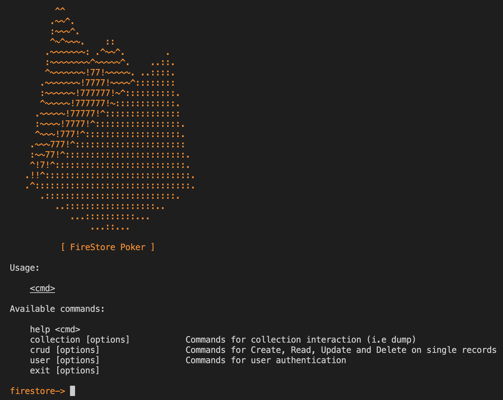

# Firestore Poker

This tool can be used to probe an existing Firebase Firestore. Allowing testing for common security vulnerabilities, such as weak permissions.

## Installation:

The easiest way is to use Docker. 

* First copy the `dist/config.yaml.dist` to `./config.yaml`
* Configure the config.yaml with the respective Firestore details.
* Build and run the container with the following commands:

```
docker build -t firestore-poker .
docker run -it --rm firestore-poker
```

This should launch the interactive shell, looking like the following:

ß

Alternatively, npm can be used to install the package. To get the latest NodeJS (16 recommended), use "n":

```
npm install -g n
n latest
npm install
```

## Usage:

To start with, copy the "config.yaml.dist" to "config.yaml" and replace the required values with the current target's respective values. These can often be located using static analysis against the application. 

Collections can be identified using dynamic requests, or otherwise searching the source for "collection". Language specific examples are shown below:

### Javascript:
```
collection(..., <Collection>...)
doc(..., <Collection>...)
```

### Java/Kotlin:
```
collection(<Collection>)
```

### Swift/Objective-C:
```
collection(<Collection>)
collectionWithPath:@"<Collection>"
```

## Usage

If installed, the following command should be available:

`firestore-poker`

If not, the application can be executed with the following:

`yarn start`

### Options:
```
Usage: firestore-poker [options]

Interact with Firebase's Firestore

Options:
  -c, --config <config>  Firebase Configuration (default: "config.yaml")
  -h, --help             display help for command
```

### Interactive Commands:
```
Usage:

    <cmd>

Available commands:

    help <cmd>
    collection [options]           Collection commands
    crud [options]                 Commands for Create, Read, Update and Delete on single records
    user [options]                 User commands
    exit [options]
```

#### Collection commands:

```
Usage:

    collection [options]

Sub-Commands:

    query [options] <collection> <query> [limit] [file] Execute a select query                  
    dump [options]                                      Dump all or single collection(s)        
    list [options]                                      List defined collections (config)       
    discovery [options] [wordlist]                      Discover collections using brute force  
    commit [options]                                    Commit discovered collections to config.
```

#### Crud commands:

```
Usage:

    crud [options]

Sub-Commands:

    create [options] <collection> <reference> <json_data> Create a record               
    read [options] <collection> <reference>               Read a record                 
    update [options] <collection> <reference> <json_data> Update a record               
    delete [options] <collection> <reference>             Delete a record               
    check [options] <collection> [reference]              Attempt all permissions 
```

#### User commmands:

```
Usage:

    user [options]

Sub-Commands:

    login [options] <username> <password>                                  
    register [options] <username> <password>                               
    logout [options]                                                       
    dump [options]
```
#### Examples

Create a sample record and auto generate the reference:

```
crud create @generate my_collection - '{"foo":"bar"}'
```

### Further Information:

* Collections are pluralised when used, therefore "user" will both check for "user" and "users". 
* Where file paths or spaces are present, strings should be encasulated within quotes.